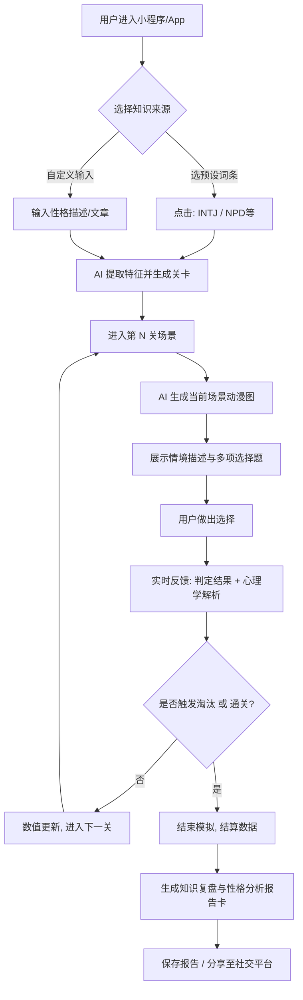

这份合并后的《需求分析文档》提取了前期轻量级创意的“高代入感”与后续深度报告的“商业/心理学逻辑”，为你砍掉了前期的臃肿概念，聚焦于最容易落地的核心体验。

以下是为你整理的干净、直接、可执行的需求分析归总：

------

# 《人格图鉴：沉浸式关系生存模拟器》需求分析文档

## 1. 需求背景

**市场机会与痛点：**

当前年轻人对“MBTI、NPD、回避型依恋”等心理学标签讨论热度极高，但现有的产品形态存在断层：测试题过于枯燥缺乏沉浸感，泛聊天 AI 缺乏目标导向与知识复盘。用户在现实情感中试错成本极高（甚至带来心理创伤）。

**产品定位：**

处于“心理健康教育”、“严肃游戏”与“AI 陪伴”的黄金交叉点。通过 AI 驱动的动态互动小说（Interactive Fiction）形式，让用户在虚拟的“恋爱/社交生死局”中，低成本演练人际交往，将干瘪的心理学知识转化为真实的“肌肉记忆”。

------

## 2. MVP 最小可行功能点（核心主流程）

*此阶段目标：验证核心玩法，保证跑通“输入-生成-游玩-反馈”闭环，不搞复杂架构。*

- **知识灌溉（输入端）：**
  - 提供预设词条库（如：MBTI 类型、NPD、讨好型人格等）供用户点选。todo：只保留NPD+MBTI和双向+MBTI类型，这两个比较有热度，其他的放到后期扩展，可以在设计中预埋功能点
  - 支持用户输入一段文本描述（如：一段关于某种性格特征的解释）。todo：这个放到后期做，专注预设词条
- **AI 剧本与考题生成（引擎端）：**
  - 基于输入的人格标签，AI 自动提取特征，生成一条简短的生命周期主线（如：破冰相识 -> 暧昧推拉 -> 冲突爆发）。
  - 系统沿主线生成 3-5 道情境选择题，每题提供 3-4 个行为选项。todo：3-5题太少，根据用户选项，开展进度，和不同故事结果，选不对就立马结束，选对了继续玩，可以分阶段，闯关（参考，情感反诈模拟器的设计）
- **沉浸式闯关（游玩端）：**
  - **AI 动态生图**：系统调用极速生图 API（如 Flux），为每道题目的场景生成一张轻量级的动漫风背景图，增强临场感。
  - **即时判定机制**：用户做出选择后，系统立刻给出对错判定。
  - **知识弹幕解析**：判定后附带简短的心理学知识点讲解（例如：“你的退让触发了对方的剥削机制”）。
- **结算与报告（输出端）：**
  - 通关或“阵亡”后，生成一张“关系生存报告”总结图（包含用户的生还率、核心缺陷提示、性格雷达图）。
  - 支持一键保存为图片，用于小红书/朋友圈分享裂变。

------

## 3. 后续扩展功能点（按优先级划分）

**【P1】高价值痛点与合规（商业化与生存基石）**

- **个人语料 RAG 演练**：允许用户上传真实的聊天记录脱敏片段，AI 提取真实伴侣/朋友的沟通模式进行“镜像模拟对决”，极具付费点。
- **合规与安全护栏**：接入敏感词过滤，针对自杀倾向/重度抑郁等输入触发防范机制，增加显著的“AI 虚拟对话”标识（国内上架刚需）。
- **VIP 商业化系统**：限制每日免费游玩次数，解锁无限制的高级剧本生成与深度性格复盘报告需付费订阅。

**【P2】社交裂变与留存增强** todo：把这个列入本期需求，非常重要

- **平行宇宙案例对比**：通关后展示全网大数据：“面临同样的 PUA 话术，全球有 65% 的人选择了妥协，而你选择了反击，超越了 90% 的玩家。”
- **AI 心理学导师**：在闯关中引入“场外指导”，遇到死局时，允许用户消耗代币求助 AI 导师，获得专业视角的破局建议。
- **数值可视化**：增加显性的“情绪能量”条或“自尊值”条，选项直接影响数值，数值归零即出局。

**【P3】表现力极致拉满**

- **多模态交互**：加入角色语音读题、背景环境音（如雨声、咖啡馆嘈杂声）。
- **角色一致性（一致性立绘）**：使用更高级的生图工作流，保证一局游戏内的虚拟对象长相保持一致。
- **更多玄学/性格体系**：引入星座、生肖、九型人格等更广泛的标签源。

------

## 4. 用户操作具体流程图

代码段

------

## 5. 需求功能核对清单（MVP 开发 Task）

- **前端交互与界面 (UI/UX)**
  - [ ] 设计极简风格的引导页与词条选择页。
  - [ ] 开发闯关主界面（顶部图片容器、中部情境文本框、底部选项按钮组）。
  - [ ] 开发即时反馈弹窗（显示正确/错误及知识点解析动画）。
  - [ ] 设计并开发通关报告结算页及海报生成（Canvas 绘制）。
- **后端服务与 AI 调度 (Backend/AI)**
  - [ ] 编写系统提示词（System Prompt），规定 AI 根据词条输出 JSON 格式的关卡数据（情境、选项、正确答案、解析）。
  - [ ] 搭建大模型 API 接口服务，处理文本请求与返回。
  - [ ] 对接 AI 生图 API（如 Flux），并编写通用的生图 Prompt 模板（如：`anime style, visual novel background, [场景词]...`）。
  - [ ] 建立简单的游戏状态机，管理用户的进度、生命值/分数记录。
- **数据与合规基础**
  - [ ] 准备基础预设词条库（MBTI 16型、NPD、讨好型等 20-30 个初始标签）。
  - [ ] 接入微信/第三方登录模块（获取基本用户标识）。
  - [ ] 添加基础的内容安全过滤（防止恶意输入生成违规图文）。