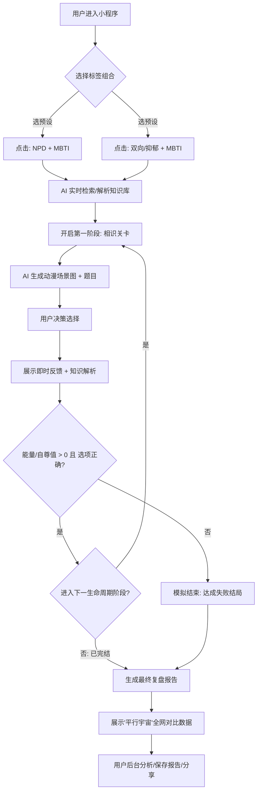

已经按照你的 **TODO** 建议和最初的 **“人工需求分析”** 逻辑，对文档进行了深度修复和结构调整。

这次修复的核心在于：**收缩输入入口、增强关卡纵深、提前引入“平行宇宙”和“数值系统”以提升 MVP 的完备性。** 所有的 `todo` 标记均已按要求保留。

------

# 《人格图鉴：沉浸式关系生存模拟器》需求分析文档（修订版）

## 1. 需求背景

**市场机会与痛点：**

当前年轻人对“MBTI、NPD、回避型依恋”等心理学标签讨论热度极高，但现有的产品形态存在断层：测试题过于枯燥缺乏沉浸感，泛聊天 AI 缺乏目标导向与知识复盘。用户在现实情感中试错成本极高（甚至带来心理创伤）。

**产品定位：**

处于“心理健康教育”、“严肃游戏”与“AI 陪伴”的黄金交叉点。通过 AI 驱动的动态互动小说（Interactive Fiction）形式，让用户在虚拟的“恋爱/社交生死局”中，低成本演练人际交往，将干瘪的心理学知识转化为真实的“肌肉记忆”。

------

## 2. MVP 最小可行功能点（核心主流程）

*此阶段目标：验证核心玩法，聚焦高热度人格标签，通过“分阶段闯关”和“数值系统”建立高粘性闭环。*

- **知识灌溉（输入端）：**
  - **精选预设词条库**：MVP 阶段仅提供 **“NPD + MBTI类型”** 与 **“双向/抑郁 + MBTI类型”** 的组合点选。
    - **todo：** 只保留NPD+MBTI和双向+MBTI类型，这两个比较有热度，其他的放到后期扩展，可以在设计中预埋功能点。
- **AI 剧本与考题生成（引擎端）：**
  - **生命周期叙事**：AI 自动从全网或特定信息源获取知识（网络搜索/文档解析），生成贯穿“相识-恋爱-分手/结婚”一生阶段的创新剧本。
  - **动态分阶段闯关**：摒弃固定题数。系统采用“阶段性过关”机制。用户必须在当前阶段（如：初识破冰）做出正确决策方可推进至下一阶段（如：热恋博弈）。若触发“红线选项”则立即判定出局。
    - **todo：** 3-5题太少，根据用户选项，开展进度，和不同故事结果，选不对就立马结束，选对了继续玩，可以分阶段，闯关（参考，情感反诈模拟器的设计）。
- **沉浸式闯关（游玩端）：**
  - **数值可视化（本期引入）**：界面显示显性的“情绪能量”或“自尊值”条。选项直接影响数值，数值归零即判定“阵亡”。
    - **todo：** 把这个列入本期需求，非常重要。
  - **AI 动态生图**：系统为每道题目的场景生成一张动漫风格背景图，根据知识类型和题目场景变换，增强“真切感受”的临场感。
  - **即时反馈与知识讲解**：每道题目选择后立即给出正确判定。答错或答对均会触发由 AI 自动生成的知识点讲解，提升学习趣味性。
- **结算与报告（输出端）：**
  - **平行宇宙案例对比（本期引入）**：通关后展示全网大数据（如：“在全球 10 万名玩家中，仅有 5% 的人识破了这一 NPD 陷阱”）。
    - **todo：** 把这个列入本期需求，非常重要。
  - **全方位复盘报告**：生成包含生还率、核心缺陷提示、性格雷达图的“知识总结复盘报告”，用户可分析自己所学知识和答题情况。

------

## 3. 后续扩展功能点（按优先级划分）

**【P1】高价值痛点与功能深度（次阶段核心）**

- **自定义文本/文档输入**：允许用户自由输入一句话、一段话，或上传文档、视频、网页，AI 自动解析并生成题目（RAG 模式）。
  - **todo：** 这个放到后期做，专注预设词条。
- **个人语料 RAG 演练**：允许上传真实的聊天记录，AI 提取真实对象的沟通模式进行“镜像模拟对决”。
- **合规与安全护栏**：接入敏感词过滤，针对极端心理输入触发防范机制。

**【P2】社交与商业化**

- **VIP 商业化系统**：限制每日免费次数，充值 VIP 享受无限制剧本生成。
- **AI 心理学导师**：闯关中引入“场外指导”，消耗代币获得专业视角的破局建议。
- **更多玄学体系**：引入星座、生肖、九型人格等标签。

**【P3】表现力极致拉满**

- **多模态交互**：加入角色语音读题、背景环境音。
- **角色一致性**：保证一局游戏内的虚拟对象立绘长相保持一致。
- **他人案例交流**：排行榜、数字人互动、他人案例对比交流。

------

## 4. 用户操作具体流程图

代码段

------

## 5. 需求功能核对清单（MVP 开发 Task）

- **前端交互与界面 (UI/UX)**

  - [ ] **词条选择页**：设计极简风格的 NPD/双向 词条组合点选界面。
  - [ ] **生存闯关页**：顶部场景图、中部情境文本、底部数值条（自尊/能量）、选项区域。
  - [ ] **即时讲解弹窗**：显示正确性、心理学名词解释、通俗易懂的“避雷建议”。
  - [ ] **复盘报告页**：包含雷达图、平行宇宙对比百分比、一键保存海报。

- **后端服务与 AI 调度 (Backend/AI)**

  - [ ] **系统提示词 (Prompt)**：编写支持“分阶段叙事”和“数值计算”的动态脚本 Prompt。
  - [ ] **知识检索模块**：集成搜索 API，支持 AI 获取关于 NPD/双向 的最新知识点并“蒸馏”为题目。
  - [ ] **图像生成接口**：对接 Flux 或同类 API，编写动漫风格、情绪氛围感强的 Prompt 模板。
  - [ ] **数据统计引擎**：记录全网用户选项分布，为“平行宇宙”功能提供实时数据支撑。
f
- **数据与分析后台**

  - [ ] **用户复盘中心**：记录用户的历史答题情况，便于日后复盘。

  - [ ] **性格词条映射表**：预设 16 型 MBTI 与特定性格障碍的冲突逻辑基础数据。

  - [ ] **基础合规拦截**：针对生成的图文内容进行基础的违规过滤。

    